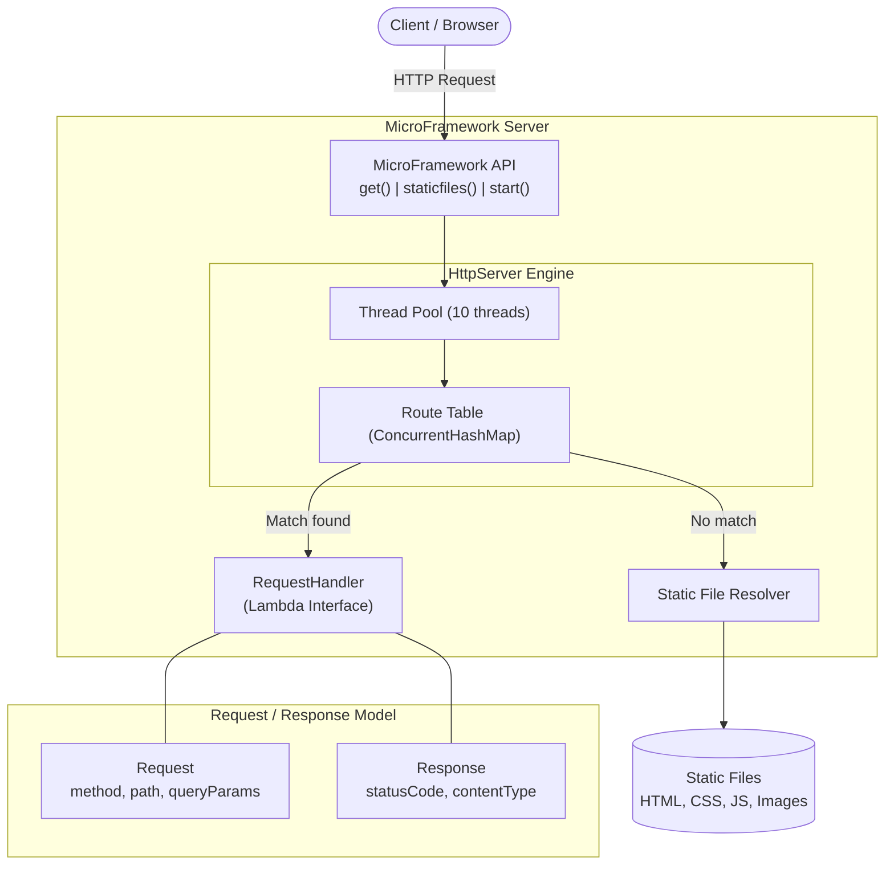

# MicroFramework

A lightweight Java web framework for building REST services and serving static files, inspired by frameworks like Spark Java.

## Project Description

MicroFramework is a minimalist web framework that converts a basic HTTP server into a fully functional tool for developing web applications. It provides:

- **REST service definition** using lambda functions via a `get()` method
- **Query parameter extraction** from incoming HTTP requests
- **Static file serving** from a configurable directory
- **Multi-threaded request handling** using a thread pool

## Architecture

### Class Diagram (UML)


### Component Diagram



### Key Components

| Class | Description |
|-------|-------------|
| `MicroFramework` | Static facade providing `get()`, `staticfiles()`, and `start()` methods |
| `HttpServer` | Multi-threaded HTTP server that routes requests to handlers or serves static files |
| `Request` | Encapsulates HTTP request data with query parameter access via `getValues()` |
| `Response` | Represents HTTP response with configurable status code, content type, and headers |
| `RequestHandler` | Functional interface (`@FunctionalInterface`) enabling lambda-based route handlers |

### Request Flow

1. Client sends HTTP request to the server
2. `HttpServer` accepts the connection and delegates to a thread pool worker
3. The request line and headers are parsed into a `Request` object
4. Query parameters are extracted and stored in the `Request`
5. If the path matches a registered REST route → the lambda handler is invoked
6. Otherwise → the server attempts to serve a static file from the configured directory
7. If no static file is found → a 404 response is returned

## Prerequisites

- **Java 17** or higher
- **Maven 3.6+**
- **Git**

## Installation and Execution

### 1. Clone the repository

```bash
git clone https://github.com/DSBAENAR/microframework.git
cd microframework
```

### 2. Build the project

```bash
mvn clean package
```

### 3. Run the application

```bash
mvn exec:java -Dexec.mainClass="org.microframework.App"
```

Or using the JAR directly:

```bash
java -cp target/classes org.microframework.App
```

### 4. Test the endpoints

Open your browser or use curl:

```bash
# REST endpoint with query parameter
curl http://localhost:8080/hello?name=Pedro
# Response: Hello Pedro

# REST endpoint returning Pi value
curl http://localhost:8080/pi
# Response: 3.141592653589793

# Static file
curl http://localhost:8080/index.html
# Response: HTML page content
```

## Usage Example

```java
import static org.microframework.server.MicroFramework.*;

public class App {
    public static void main(String[] args) {
        staticfiles("/webroot");

        get("/hello", (req, res) -> "Hello " + req.getValues("name"));

        get("/pi", (req, res) -> {
            return String.valueOf(Math.PI);
        });

        start();
    }
}
```

## Running Tests

```bash
mvn test
```

### Test Evidence

The project includes **29 automated tests** covering:

- **RequestTest** (12 tests): Query parameter parsing, URL decoding, headers, parameter immutability
- **ResponseTest** (5 tests): Status codes, content types, custom headers
- **HttpServerTest** (10 tests): Integration tests for REST endpoints, static file serving, 404 handling, content type detection, multiple query parameters
- **AppTest** (2 tests): Route registration and static files configuration

```
[INFO] Tests run: 29, Failures: 0, Errors: 0, Skipped: 0
[INFO] BUILD SUCCESS
```

## Project Structure

```
microframework/
├── pom.xml
├── README.md
├── .gitignore
└── src/
    ├── main/
    │   ├── java/org/microframework/
    │   │   ├── App.java                          # Example application
    │   │   └── server/
    │   │       ├── HttpServer.java                # Core HTTP server
    │   │       ├── MicroFramework.java            # Static API facade
    │   │       ├── Request.java                   # HTTP request with query params
    │   │       ├── RequestHandler.java            # Lambda functional interface
    │   │       └── Response.java                  # HTTP response
    │   └── resources/webroot/
    │       ├── index.html                         # Demo HTML page
    │       ├── styles.css                         # Stylesheet
    │       └── app.js                             # Frontend JavaScript
    └── test/java/org/microframework/
        ├── AppTest.java                           # App configuration tests
        └── server/
            ├── HttpServerTest.java                # Integration tests
            ├── RequestTest.java                   # Request unit tests
            └── ResponseTest.java                  # Response unit tests
```

## Built With

- **Java 17** - Programming language
- **Maven** - Build and dependency management
- **JUnit 4.13.2** - Testing framework
- **Java ServerSocket API** - HTTP server implementation (no external frameworks)

## Author

David Baena
